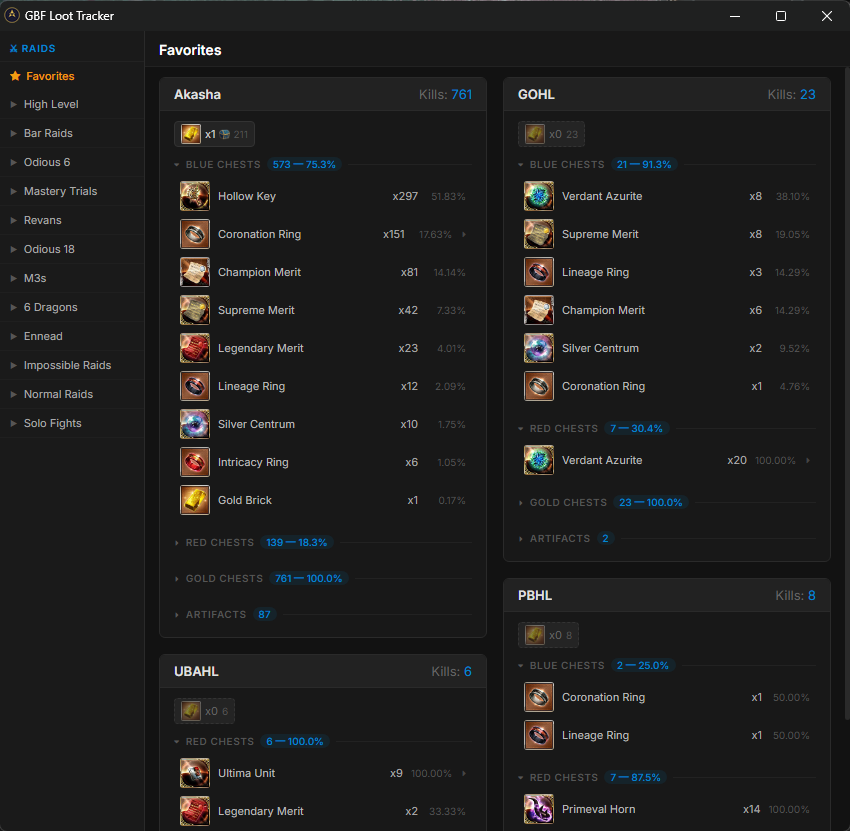
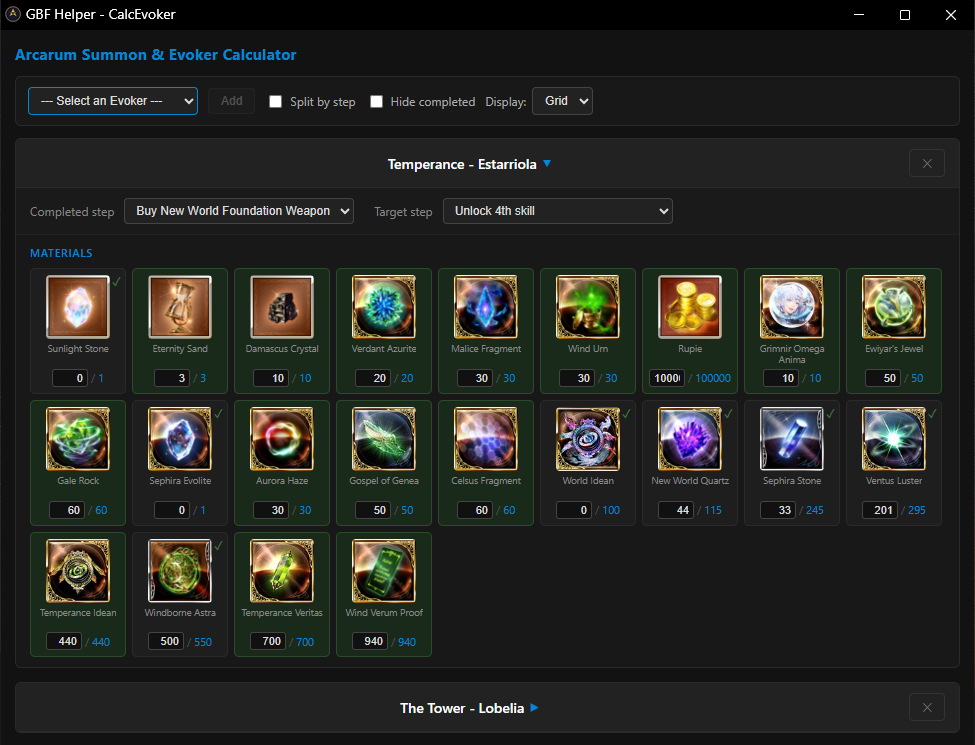
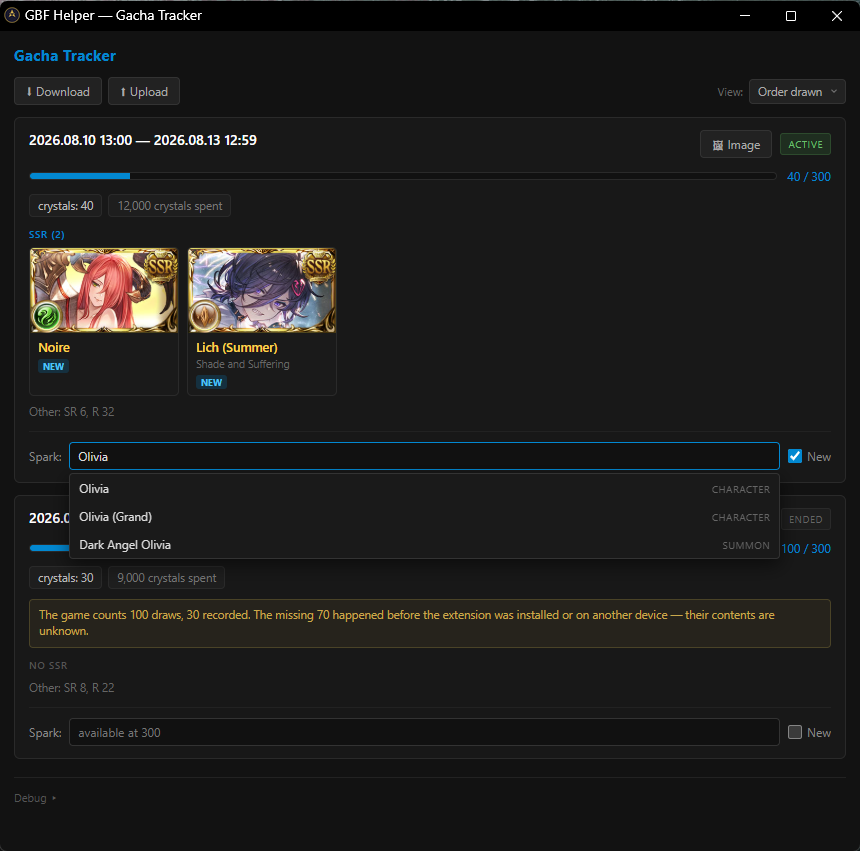
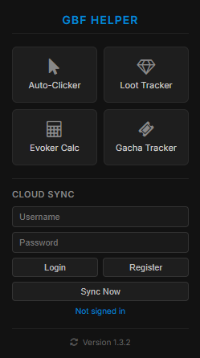
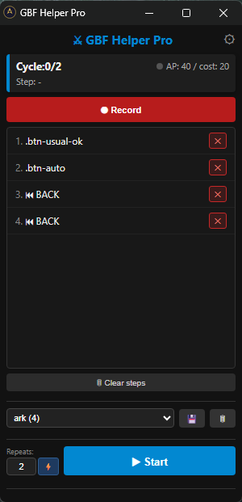

# GBF Helper Extension

A browser extension for Granblue Fantasy bundling several independent tools:

* **Loot Tracker** — records raid drops automatically and shows them in a separate window (favorites, pinning, JSON export/import).
* **Evoker Calculator** — tracks remaining materials for every Evoker crafting stage, with optional sync to a server.
* **Gacha Tracker** — records pulls automatically: periods, spark counter, dropped SSRs, weapon → character resolution, a banner saved as a picture, JSON export/import.
* **Auto-Clicker** *(optional)* — records and replays click macros with jitter, captcha/low-AP detection, and sound alerts.

## Screenshots

| Loot Tracker | Evoker Calculator |
|---|---|
|  |  |
| **Gacha Tracker** | **Popup menu** |
|  |  |

More screenshots

**Auto-Clicker control panel**

## Installation

Every [release](https://github.com/neo21400/gbf-helper/releases/latest) ships two archives. They are the same extension; the difference is the Auto-Clicker.

| | `gbf-helper-<version>.zip` | `gbf-helper-<version>-no-clicker.zip` |
|---|---|---|
| Loot Tracker, Evoker Calculator, Gacha Tracker | yes | yes |
| Auto-Clicker | yes | no |
| `debugger` permission | requested | not requested |
| "started debugging this browser" warning | while the clicker is attached | never |

The Auto-Clicker needs the `debugger` permission — that is what lets it dispatch real mouse events — and Chrome keeps the warning on screen the whole time it is attached. If you don't need the clicker, take the `no-clicker` build and the warning never appears.

> [!WARNING]
> **The Auto-Clicker is used at your own risk.** Automating play is against Granblue Fantasy's terms of service, and accounts get suspended or permanently banned for it. Nothing the clicker does — jitter, human-like cursor movement, captcha detection — makes that any less true; it dispatches input on your behalf and that is exactly what the rules forbid. Neither the author of this extension nor anyone else can appeal a ban for you. If you would rather not have the option on your machine at all, take the `no-clicker` build.
>
> The Loot Tracker, Evoker Calculator and Gacha Tracker don't automate anything — they only read responses the game sends to your own browser.

To install: unzip, open `chrome://extensions`, turn on **Developer mode**, click **Load unpacked** and pick the unpacked `gbf-helper` folder.

Chrome treats the two builds as the same extension, so they share their data. You can move from one to the other — in any folder — without losing loot history, calculator progress, recorded macros or window positions.

## Usage

Click the extension icon in the toolbar — the popup menu opens the tool you need. Loot Tracker, Calculator and Gacha Tracker each open in their own window and remember their size and position; the Auto-Clicker gets a compact control panel.

The Loot and Gacha trackers need the game tab open — they read the game's own responses, so keep `game.granbluefantasy.jp` running while you play.

## Pinned items in the Loot Tracker

Right-click any row of loot to pin it to one of the two rows above the list. Pins are kept per raid and travel with your account, so the things you actually farm a raid for stay in front of you instead of somewhere down the Blue Chests column.

A pin shows the total you've got, and next to a chest icon — **how many chests of the kind that item drops from have opened since it last dropped**. `Gold Brick x1 🔵36` means thirty-six blue chests have come and gone since the last one. It's counted in chests rather than kills on purpose: a kill that dropped no blue chest says nothing about a blue-chest item. The number turns amber when the drought is twice as long as that item's usual interval, and hovering the pin spells the whole thing out — total, how many of those chests contained it, and the average interval.

An item you pinned but never got is still shown, as `x0` — "none in 419 blue chests" is usually the reason for pinning it in the first place.

The same pins appear in every card of the **Favorites** tab, and right-clicking loot there pins to that card's raid.

## Updating

The popup shows the installed version at the bottom and checks for a newer one every time you open it. Nothing appears unless there is something to say: a line "New version X available" shows up under the version, and clicking it opens the release page. The icon next to the version re-checks on the spot — the automatic check answers from a cached result for a few hours, the manual one always asks GitHub.

It can't install the update for you — Chrome only updates extensions that came from the Web Store. So updating stays manual: unzip the new archive over the old folder and press **Reload** on the extension card in `chrome://extensions`.

## The calculator also has a standalone page

The Evoker Calculator exists both inside the extension and as a standalone web page at **https://gbf.keka312.com**. They work against the same account and the same server-side data — but on your machine they are two independent things.

Each keeps its own local copy of your progress, and you sign in to each one separately. Nothing crosses over locally: the two meet only on the server, so progress entered in one shows up in the other after a sync. The page syncs when it loads; the extension syncs once per browser session, after every change, and on demand via **Sync Now** in the popup.

## Credits

The Loot Tracker started from **[cajunwildcat/GBF-Loot-Extension](https://github.com/cajunwildcat/GBF-Loot-Extension)** — the way the game's battle results are read and turned into per-raid drop statistics comes from there. Everything since is rebuilt around it: the tracker lives in its own window, keeps favorites, pinned items with per-chest counters, server sync, and it ships as one part of a larger extension. Thanks to them for the original.

## License

GNU GPL v3 — see [LICENSE](LICENSE).
